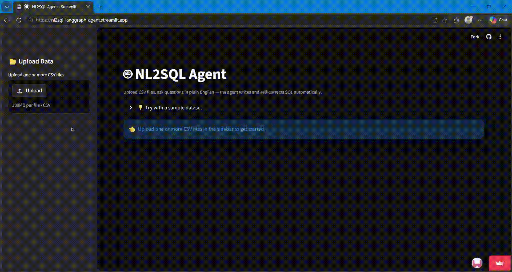

# NL2SQL LangGraph Agent

An agentic Text-to-SQL system built with LangGraph and LangChain. Upload **any CSV dataset** and ask **any question about your data** in plain English — the agent autonomously writes, executes, and self-corrects SQL queries using LLM reasoning. No SQL knowledge required.

🚀 **Live Demo**: https://nl2sql-langgraph-agent.streamlit.app/



---

## What It Does

You upload any CSV file - sales data, survey results, financial records, anything tabular - and simply ask questions about it in plain English:

- *"What are the top 5 products by revenue?"*
- *"How many passengers survived by gender?"*
- *"Which country has the most Netflix titles?"*
- *"What is the average loan amount by state?"*

The agent figures out the rest. It reads your data, writes the SQL, runs it, checks if the answer makes sense, and if not — it fixes itself and tries again. You get a clean natural language answer along with the SQL query and raw result.

**No SQL knowledge needed. Works on any dataset you upload.**

---

## LangGraph Architecture

The agent is built as a stateful graph with 5 nodes and a self-correction cycle:

```
Schema Inspector → SQL Writer → SQL Executor → Result Validator → Answer Explainer
                                                      ↑                    |
                                                      └───── retry loop ───┘
                                                        (up to 3 attempts)
```

- **Schema Inspector** - reads uploaded tables, extracts column names, types, and sample values to give the LLM full context
- **SQL Writer** - writes SQLite SQL based on your question and schema; on retry, injects the previous error for self-correction
- **SQL Executor** - runs the query against an in-memory SQLite database
- **Result Validator** - checks if the result correctly answers your question; routes back to SQL Writer on failure
- **Answer Explainer** - translates raw query results into a plain English insight

---

## Features

- Ask **any question** about your data in plain English
- Upload **any CSV file** - works on any tabular dataset
- Upload **multiple CSVs** for multi-table join queries
- One-click sample datasets built into the UI (Titanic, Netflix)
- Self-correcting agent - retries up to 3 times on failure
- Live agent step visibility — watch every node execute in real time
- Shows generated SQL and raw results alongside the natural language answer

---

## Tech Stack

| Category | Tools |
|---|---|
| Agent Framework | LangGraph, LangChain |
| LLM | OpenRouter API |
| Frontend | Streamlit |
| Database | SQLite (in-memory) |
| Data Processing | Pandas |
| Language | Python 3.11 |

---

## Run Locally

```bash
git clone https://github.com/om-sri/NL2SQL-LangGraph-Agent.git
cd NL2SQL-LangGraph-Agent
pip install -r requirements.txt
streamlit run app.py
```

Create a `.env` file in the root folder:

```
OPENROUTER_API_KEY=your_key_here
```

Get a free API key at [openrouter.ai](https://openrouter.ai)

---

## Sample Datasets Included

| Dataset | Rows | Try asking |
|---|---|---|
| 🚢 Titanic | 891 | "What was the survival rate by passenger class?" |
| 🎬 Netflix | 8,800 | "Which country has the most titles?" |

Or upload your own CSV and ask anything about it.


